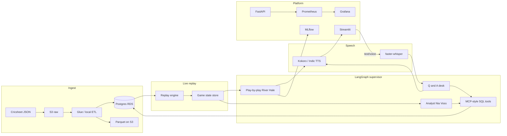

# Architecture

## Data flow
1. Cricsheet match JSON lands in `data/raw` (and S3 `raw/` when configured).
2. ETL flattens nested innings/overs/deliveries into relational tables and Parquet.
3. The replay engine applies one delivery every N seconds and writes `game_state`.
4. The supervisor routes the event to play-by-play (always) and analyst (wicket, boundary, or end of over).
5. Viewer questions go to the Q&A node, which may call read-only SQL tools.
6. TTS speaks commentary and answers; Whisper transcribes microphone input.
7. Judge scores and prompt versions are logged to MLflow before prompt changes.

## Personas
Original voices only: **River Hale** (English play-by-play), **Nia Voss** (English analyst), **Arjun Mehta** / **Kavya Natarajan** (Hindi/Tamil). No cloned broadcasters.
